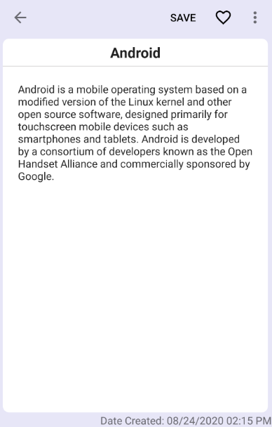
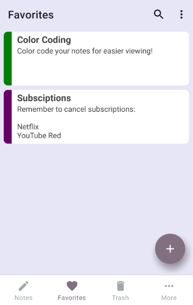

<h1 align = 'center'>Vanilla Notes (Abandoned)</h1> 
<p align = 'center'>
Vanilla Notes is a free, open source android application that lets users take notes. The focus is to have a clean, simple, yet functional interface while still having the essentials. It is fully offline, doesn't use unnecessary permissions, and does not save your notes to anywhere other than on your device.
</p>

<p align = 'center'>
  <a href="https://opensource.org/licenses/Apache-2.0"></a>
  <a href="https://android-arsenal.com/api?level=21"></a>

</p>
<br/>

## Main Features

The final application will have the following features:

- [x] Reminders
- [ ] Checklists
- [x] Color code your notes
- [x] Pin notes to your notification
- [x] Trash bin for deleted notes
- [x] Sort by Title or Date Created
- [x] Favorite notes to view them easier
- [ ] Themes / Dark Mode
- [x] Import/Export Backup
- [ ] Widgets (?)

## Screenshots (Not Final)






## Libraries & Tools
The minimum Android version required is Android 5.0 (SDK 21); Target version is Android 10 (SDK 29)

Project is created with and uses:

- [Android Studio](https://developer.android.com/studio/install) using [Java](https://www.java.com/en/)
- [AndroidX](https://developer.android.com/jetpack/androidx) - AndroidX is a major improvement to the original Android Support Library, which is no longer maintained.
- [Gson](https://github.com/google/gson) - A JSON library for Java
- [material.io](https://material.io/) - Material guidelines with resources such as components and icons
- [Color Picker Library](https://github.com/kristiyanP/colorpicker) - Material Color Picker asset created by [Kristiyan Petrov](https://github.com/kristiyanP)
- [Item Click Support for RecyclerView](https://www.littlerobots.nl/blog/Handle-Android-RecyclerView-Clicks/) - Onclick handling for RecyclerView items by [Hugo Visser](https://www.littlerobots.nl/blog/)
- [Floating Action Menu](https://github.com/Clans/FloatingActionButton) - Floating Action Button with an option to have multiple child buttons by [Dmytro Tarianyk](https://github.com/Clans)


## Launch

**Abandoned**

## License
```
Copyright 2020 DD155

   Licensed under the Apache License, Version 2.0 (the "License");
   you may not use this file except in compliance with the License.
   You may obtain a copy of the License at

       http://www.apache.org/licenses/LICENSE-2.0

   Unless required by applicable law or agreed to in writing, software
   distributed under the License is distributed on an "AS IS" BASIS,
   WITHOUT WARRANTIES OR CONDITIONS OF ANY KIND, either express or implied.
   See the License for the specific language governing permissions and
   limitations under the License.
```
